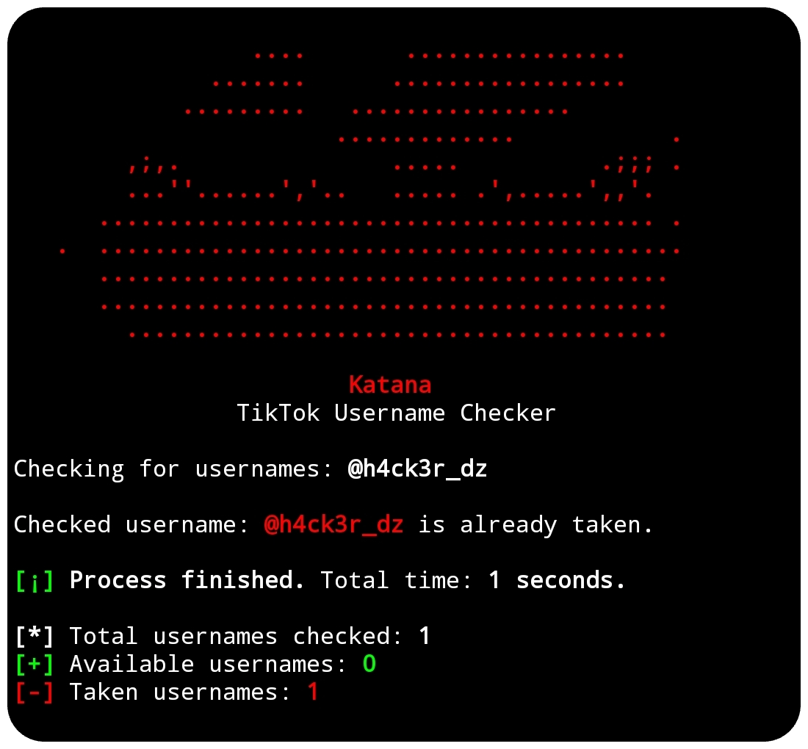

# Katana
**Katana** — TikTok Username Checker.


## Preview


## Install

To use the Katana script, follow these steps:

1. Clone the repository:

    ```
    git clone https://github.com/haithamaouati/Katana.git
    ```

2. Change to the Katana directory:

    ```
    cd Katana
    ```
    
3. Change the file modes
    ```
    chmod +x katana.sh
    ```
    
5. Run the script:

    ```
    ./katana.sh
    ```

## Usage

   Usage: `./katana.sh -u <username>`

##### Options:

`-u`, `--username`   Username or file with usernames

`-h`, `--help`       Show this help message

##### Example:

Check username: `./katana.sh -u hacker_dz`

Check file with usernames: `./katana.sh -u usernames.txt`

## Dependencies

The script requires the following dependencies:

- [curl](https://curl.se/): `pkg install curl - y`
- [grep](): `pkg install grep -y`
- [sed](): `pkg install sed -y`

Make sure to install these dependencies before running the script.

## Environment
- Tested on [Termux]()

## Author

Made with :coffee: by **Haitham Aouati (YHΞ)**
  - GitHub: [github.com/haithamaouati](https://github.com/haithamaouati)

## License

Katana is licensed under [WTFPL license](LICENSE).
